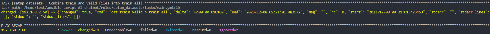

# Customer Chatbot Environment Setup with Ansible
## Overview
This repository contains an Ansible playbook for setting up a customer chatbot environment. It is designed to automate the deployment and configuration of a chatbot application,
leveraging the AI Starter Kit for Customer Chatbot using Intel® Extension for PyTorch, as found in the [oneapi-src/customer-chatbot](https://github.com/oneapi-src/customer-chatbot) GitHub repository.

## Project Structure
The Ansible playbook is structured into multiple roles, each handling a specific part of the setup process:

- **setup_environment:** Configures environment variables and workspace directory.
- **setup_git_repo:** Clones the necessary GitHub repository and sets up the project structure.
- **setup_dir:** Setup the working directories needed 
- **setup_conda:** Handles the installation and setup of the Miniconda environment.
- **creating_conda_env:** Setup of the intel conda virutal environment.
- **install_dependencies:** Installs necessary packages like Git and Apache2 Utils and Python packages.
- **setup_python:** Sets up Python in the Conda environment and installs required Python packages.
- **setup_torchserve:** Installs TorchServe and its dependencies.
- **setup_datasets:** Sets up data directories and downloads necessary data files.

>Each role has its own directory under the `roles/` directory, with a `tasks/main.yml` file containing relevant tasks.

## Prerequisites
```
ansible [core 2.16.0]
  config file = None
  configured module search path = ['/home/test/.ansible/plugins/modules', '/usr/share/ansible/plugins/modules']
  ansible python module location = /home/test/.local/pipx/venvs/ansible/lib/python3.10/site-packages/ansible
  ansible collection location = /home/test/.ansible/collections:/usr/share/ansible/collections
  executable location = /home/test/.local/bin/ansible
  python version = 3.10.12 (main, Nov 20 2023, 15:14:05) [GCC 11.4.0] (/home/test/.local/pipx/venvs/ansible/bin/python)
  jinja version = 3.1.2
  libyaml = True
```
Access to an Ubuntu-based system where you have administrative privileges.

## Usage
1. **Clone the Repository:** Start by cloning this repository to your local machine or the control node.

```
git clone https://github.com/yuandjom/ansible-customer-chatbot.git
cd ansible-customer-chatbot
```
2. **Configure Variables:** Edit the vars/main.yml file to set up your workspace path and other variables.

2. **Configure hosts:** Edit the inventory/setup_customer_chatbot/main.yml file to set up your workspace path and other variables.

3. **Run the Playbook:** Execute the Ansible playbook.
```
ansible-playbook -i hosts.ini setup_customer_chatbot.yml -vv
ansible-playbook -i inventory/setup_customer_chatbot/hosts.ini setup_customer_chatbot.yml -vv
```
This command will run the playbook and execute each role sequentially.

## Customization
You can customize the playbook according to your requirements by editing the tasks in the respective roles. Ensure that you understand each role's functionality before making changes.

## Contributing
Contributions to this playbook are welcome. Please follow the standard GitHub pull request process to submit your changes.

## References
AI Starter Kit for Customer Chatbot using Intel® Extension for PyTorch: [GitHub Repository](https://github.com/oneapi-src/customer-chatbot)
